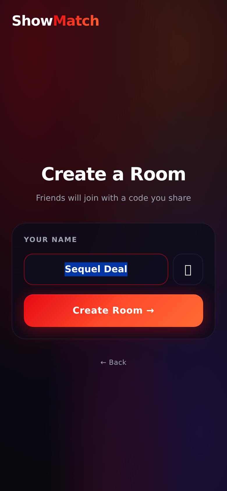
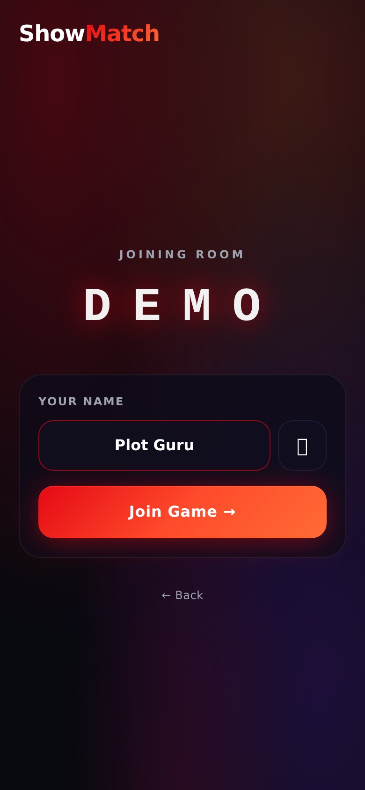
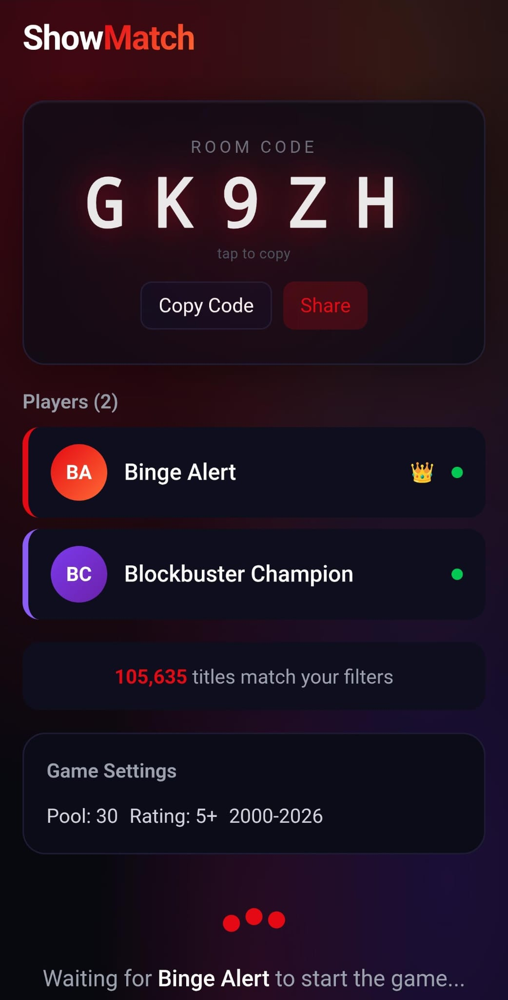
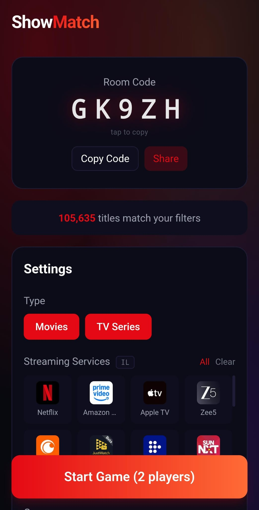
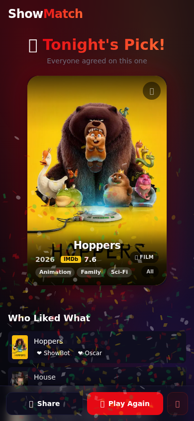

# 🎯 ShowMatch

> **Tinder swipes meet Kahoot energy** — the group movie & TV-show picker that ends the "what should we watch?" debate.

**[→ Open the app](https://showmatch.vercel.app)**

One person creates a room, friends join with a 5-letter code, everyone swipes through the same title pool, and whatever the group agrees on wins. No more arguing.

---

## Screenshots

| Home | Create | Join |
|------|--------|------|
|  |  |  |

| Lobby (guest) | Room Settings (host) | Swipe |
|---------------|----------------------|-------|
|  |  |  |

| Winner | Results |
|--------|---------|
|  |  |

---

## Features

- 🃏 **Tinder-style swiping** — Like, Pass, or ⭐ Super-Like (once per game, guaranteed finalist)
- 🚀 **Multiplayer rooms** — join with a 5-letter code, no account needed
- 🎬 **TMDB + OMDB data** — real posters, ratings, trailers, cast, streaming providers
- 🎛️ **Filters** — movies / TV / both, streaming service, genres, era, min rating, pool size
- 📍 **Region-aware** — providers matched to your country automatically
- 🏆 **Smart winner** — single match wins instantly; multiple matches → ranking round
- 🃏 **Wildcard mode** — host picks a surprise title from top-liked if nobody agrees
- 🎉 **Celebrations** — confetti, sounds, swipe reveal, full game stats
- 🔁 **Play again** — host can restart with the same room and players
- 📱 **Mobile-first** — designed for phones; tap to flip a card for full details
- 🔄 **Session persistence** — refresh the page mid-game and rejoin automatically
- 📖 **Built-in tutorial** — interactive walkthrough on first game (replayable anytime)

---

## Tech Stack

| Layer | Technology |
|---|---|
| Frontend | Next.js 14 (App Router) + Tailwind CSS + Framer Motion |
| Realtime | Socket.io (Express server) |
| State | Zustand |
| Content | TMDB API (posters, metadata, streaming providers) + OMDB (RT scores) |
| Monorepo | npm workspaces |

No database — all state is in-memory on the socket server. Perfect for a local-network Pi deployment.

---

## Prerequisites

- **Node.js 18+** (v22 recommended)
- **TMDB account** — [themoviedb.org](https://www.themoviedb.org/) → Settings → API → *Read Access Token* (the long JWT, **not** the v3 API key)
- **OMDB API key** — [omdbapi.com](https://www.omdbapi.com/apikey.aspx) (free tier is fine)

---

## Setup

### 1. Clone

```bash
git clone https://github.com/IdoSagiv/showmatch.git
cd showmatch
npm install
```

### 2. Environment variables

Create two `.env` files from the template below.

**`apps/web/.env.local`**
```env
# TMDB Read Access Token (long JWT — NOT the v3 API key)
TMDB_READ_ACCESS_TOKEN=eyJhbGciOiJSUzI1NiJ9...

# OMDB API key
OMDB_API_KEY=abc12345

# Optional: override the socket server URL.
# If omitted, the app connects to port 3001 on whatever hostname the browser used —
# so LAN / Tailscale / localhost all just work automatically.
# NEXT_PUBLIC_SOCKET_URL=http://192.168.1.100:3001
```

**`apps/socket-server/.env`**
```env
TMDB_READ_ACCESS_TOKEN=eyJhbGciOiJSUzI1NiJ9...
OMDB_API_KEY=abc12345
```

---

## Scripts

| Script | Purpose |
|---|---|
| `bash scripts/deploy.sh` | **Cloud deploy** — build + push to Fly.io + Vercel (primary) |
| `npm run dev` | Development — hot-reload on localhost |
| `bash scripts/prod.sh` | Local production — for Pi / LAN use only |

---

## Running

### Development

```bash
npm run dev
```

Starts both servers with hot-reload:
- **Next.js** → `http://localhost:3000`
- **Socket server** → `http://localhost:3001`

> Pages compile on first visit in dev mode — expect a short pause the first time you navigate to each screen.

### Local production _(optional — Pi / LAN only)_

Only needed if you want a local network copy independent of the cloud. Not required for normal use — the live app at **https://showmatch.vercel.app** runs 24/7 regardless of whether this machine is on.

```bash
bash scripts/prod.sh
```

Kills any running servers, rebuilds Next.js, and starts both in the background. Logs: `/tmp/showmatch-prod.log`.

---

## How to Play

1. **Host** opens the app and taps **Create Game**
2. **Friends** join by entering the 5-letter room code on the home screen
3. Host sets filters (streaming service, genre, era, rating…) and taps **Start**
4. A quick tutorial walks everyone through the swipe controls on first play
5. Everyone swipes the same pool simultaneously:
   - **Swipe right / ❤️** — Like
   - **Swipe left / ✖️** — Pass
   - **Swipe up / ⭐** — Super-Like (once per game; guaranteed finalist)
   - **Tap the card** — flip to see full details, cast, and streaming info
6. **One title gets all likes** → instant winner 🎉
7. **Multiple matches** → quick ranking round; highest combined score wins
8. **No matches** → host picks a wildcard from the most-liked titles
9. Results screen shows the winner, where to watch, trailer, and full swipe breakdown

---

## Project Structure

```
showmatch/
├── apps/
│   ├── web/               # Next.js frontend (port 3000)
│   │   ├── src/app/       # Pages (home, lobby, game, results, join)
│   │   ├── src/components/# UI components
│   │   ├── src/hooks/     # useSocket, useBeforeUnload
│   │   ├── src/stores/    # Zustand game store
│   │   └── public/sounds/ # Synthesised sound effects
│   └── socket-server/     # Express + Socket.io server (port 3001)
│       └── src/
│           ├── handlers/  # Room, game, ranking event handlers
│           ├── state/     # RoomManager, GameSession
│           └── lib/       # TMDB + OMDB API clients
└── packages/
    └── shared/            # Shared provider-filter logic (used by both apps)
```

---

## API Keys

| Key | Where to get it | Used for |
|---|---|---|
| `TMDB_READ_ACCESS_TOKEN` | [themoviedb.org](https://www.themoviedb.org/settings/api) — *Read Access Token* | Discover titles, posters, providers, trailers |
| `OMDB_API_KEY` | [omdbapi.com/apikey.aspx](https://www.omdbapi.com/apikey.aspx) | Rotten Tomatoes scores |

> ⚠️ Use the TMDB **Read Access Token** (long JWT), not the short v3 API key. The app sends it as `Authorization: Bearer <token>`.

---

## Cloud Deployment (free)

| Service | Hosts | URL | Cost |
|---|---|---|---|
| **Fly.io** | Socket server | `https://showmatch-socket.fly.dev` | Free — 1 shared-CPU VM, always-on |
| **Vercel** | Next.js frontend | `https://showmatch.vercel.app` | Free — global CDN |

---

### First-time setup

#### 1. Socket server — Fly.io

```bash
# Install Fly CLI (once)
curl -L https://fly.io/install.sh | sh

# From repo root — provision the app (sets a unique name + region):
fly launch --no-deploy

# Edit fly.toml: replace app = "showmatch-socket" with the name Fly assigned.

# Set secrets (never committed to git):
fly secrets set \
  TMDB_READ_ACCESS_TOKEN=eyJ... \
  OMDB_API_KEY=abc12345

# First deploy:
fly deploy
```

Your socket server will be live at `https://<app-name>.fly.dev`.

> `auto_stop_machines = false` in `fly.toml` keeps the VM always-on. In-memory room state is lost on restarts, so the machine must never spin down mid-game.

#### 2. Frontend — Vercel

1. Import the GitHub repo at [vercel.com/new](https://vercel.com/new)
2. Set **Root Directory** → `apps/web`
3. Add environment variables:

| Variable | Value | When used |
|---|---|---|
| `NEXT_PUBLIC_SOCKET_URL` | `https://<your-fly-app>.fly.dev` | Build-time (baked into client bundle) |
| `TMDB_READ_ACCESS_TOKEN` | your TMDB JWT | Server-side API routes |
| `OMDB_API_KEY` | your OMDB key | Server-side API routes |

4. Click **Deploy** — then use `bash scripts/deploy.sh` for all future deploys.

> `NEXT_PUBLIC_SOCKET_URL` is baked in at build time. If you change the Fly.io app name, update this variable in Vercel and redeploy.

---

### Deploying updates

After merging changes to `main`, run the deploy script from the repo root:

```bash
bash scripts/deploy.sh
```

The script enforces three guards before touching anything:

| Guard | What it checks |
|---|---|
| Branch | Must be on `main` |
| Clean tree | No uncommitted changes |
| Synced | Local `main` matches `origin/main` exactly (no unpushed or un-pulled commits) |

If all guards pass it deploys both services in sequence:
1. **Fly.io** — builds a fresh Docker image and rolls it out (`fly deploy`)
2. **Vercel** — deploys the Next.js frontend (`vercel deploy --prod`)

> Credentials are read from `~/.showmatch_creds` (not committed to git).

---

## License

MIT
