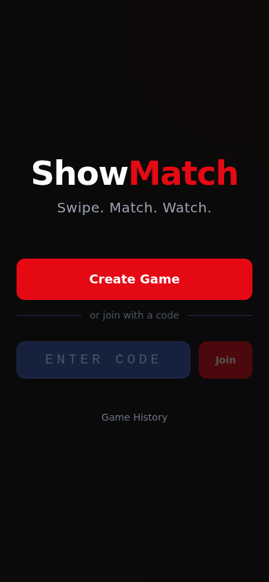
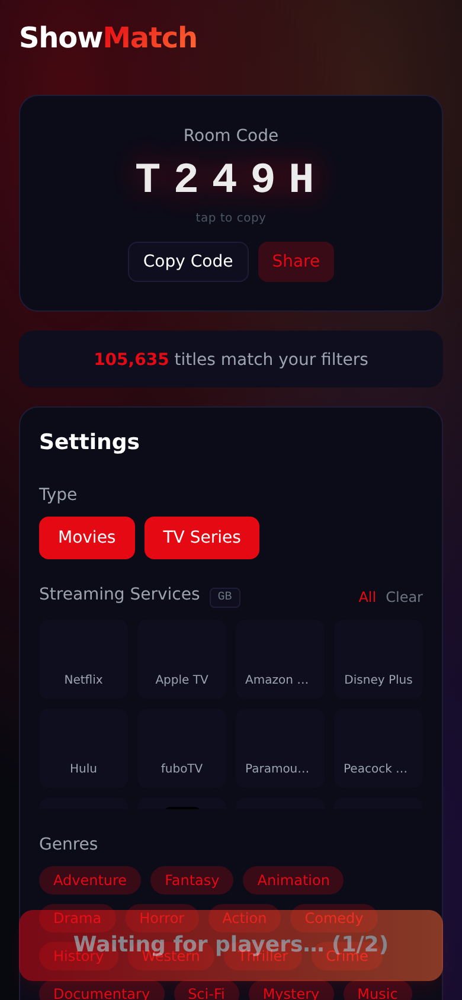
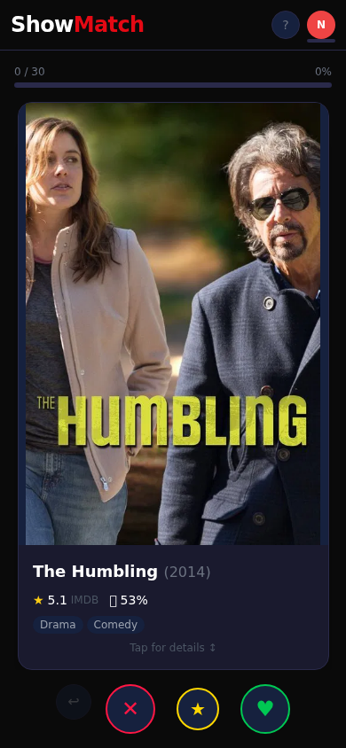
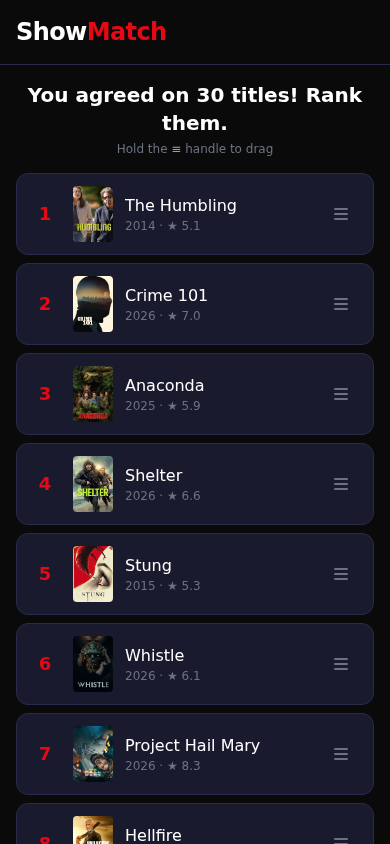

# 🎯 ShowMatch

> **Tinder swipes meet Kahoot energy** — the group movie & TV-show picker that ends the "what should we watch?" debate.

One person creates a room, friends join with a 5-letter code, everyone swipes through the same title pool, and whatever the group agrees on wins. No more arguing.

---

## Screenshots

| Home | Lobby | Swiping | Results |
|------|-------|---------|---------|
|  |  |  |  |

<details>
<summary>📸 How to add your own screenshots</summary>

Run the app, open `http://localhost:3000` in your browser, and screenshot each screen. Save them to `apps/web/public/screenshots/`.

</details>

---

## Features

- 🃏 **Tinder-style swiping** — Like, Pass, or ⭐ Super-Like (once per game)
- 🚀 **Multiplayer rooms** — join with a 5-letter code, no account needed
- 🎬 **TMDB + OMDB data** — real posters, ratings, trailers, cast & crew
- 🎛️ **Filters** — movies / TV / both, streaming services, genres, era, rating
- 📍 **Region-aware** — providers matched to your country automatically
- 🏆 **Smart winner** — single match wins instantly; multiple matches → ranking round
- 🃏 **Wildcard mode** — if nobody agrees, a random "wildcard" pick breaks the tie
- 🎉 **Celebrations** — confetti, sounds, swipe reveal, game stats
- 🔁 **Play again** — host can restart with the same room
- 📱 **Mobile-first** — designed for phones on a shared TV night

---

## Tech Stack

| Layer | Technology |
|---|---|
| Frontend | Next.js 14 (App Router) + Tailwind CSS + Framer Motion |
| Realtime | Socket.io (Express server) |
| State | Zustand |
| Content | TMDB API (posters, metadata, streaming providers) + OMDB (RT scores) |
| Monorepo | npm workspaces |

No database — all state is in-memory on the socket server. Perfect for a local-network Pi deployment.

---

## Prerequisites

- **Node.js 18+** (v22 recommended)
- **TMDB account** — [themoviedb.org](https://www.themoviedb.org/) → Settings → API → *Read Access Token* (the long JWT, **not** the v3 API key)
- **OMDB API key** — [omdbapi.com](https://www.omdbapi.com/apikey.aspx) (free tier is fine)

---

## Setup

### 1. Clone

```bash
git clone https://github.com/IdoSagiv/showmatch.git
cd showmatch
npm install
```

### 2. Environment variables

Create two `.env` files from the template below.

**`apps/web/.env.local`**
```env
# TMDB Read Access Token (long JWT — NOT the v3 API key)
TMDB_READ_ACCESS_TOKEN=eyJhbGciOiJSUzI1NiJ9...

# OMDB API key
OMDB_API_KEY=abc12345

# Socket server URL — use your machine's LAN IP for multi-device play
NEXT_PUBLIC_SOCKET_URL=http://localhost:3001
```

**`apps/socket-server/.env`**
```env
TMDB_READ_ACCESS_TOKEN=eyJhbGciOiJSUzI1NiJ9...
OMDB_API_KEY=abc12345
```

> **Multi-device (LAN) play:** replace `localhost` in `NEXT_PUBLIC_SOCKET_URL` with your machine's local IP (e.g. `http://192.168.1.100:3001`). Other devices on the same Wi-Fi can then reach the socket server.

---

## Running

### Development

```bash
npm run dev
```

Starts both servers concurrently:
- **Next.js** → `http://localhost:3000`
- **Socket server** → `http://localhost:3001`

### Raspberry Pi / always-on LAN server

```bash
# Install pm2 globally (once)
npm install -g pm2

# Start both apps and persist across reboots
pm2 start npm --name "showmatch-web"    -- run dev:web
pm2 start npm --name "showmatch-socket" -- run dev:socket
pm2 save
pm2 startup   # follow the printed command to enable auto-start
```

Then access from any device on the network at `http://<pi-ip>:3000`.

---

## How to Play

1. **Host** opens the app and clicks **Create Game**
2. **Friends** join by entering the 5-letter room code (or scanning if you add QR)
3. Host configures filters (streaming service, genre, era…) and hits **Start**
4. Everyone swipes through the same pool — ❤️ like, ✖️ pass, ⭐ super-like
5. **If one title gets all likes** → instant winner 🎉
6. **Multiple matches** → quick ranking round; highest combined rank wins
7. **No matches** → wildcard pick from the titles people liked most
8. Results screen shows the winner, streaming links, trailer, and full swipe breakdown

---

## Project Structure

```
showmatch/
├── apps/
│   ├── web/               # Next.js frontend (port 3000)
│   │   ├── src/app/       # Pages (home, lobby, game, results, join)
│   │   ├── src/components/# UI components
│   │   ├── src/hooks/     # useSocket, useBeforeUnload
│   │   ├── src/stores/    # Zustand game store
│   │   └── public/sounds/ # Synthesised sound effects
│   └── socket-server/     # Express + Socket.io server (port 3001)
│       └── src/
│           ├── handlers/  # Room, game, ranking event handlers
│           ├── state/     # RoomManager, GameSession
│           └── lib/       # TMDB + OMDB API clients
└── packages/
    └── shared/            # Shared provider-filter logic (used by both apps)
```

---

## API Keys

| Key | Where to get it | Used for |
|---|---|---|
| `TMDB_READ_ACCESS_TOKEN` | [themoviedb.org](https://www.themoviedb.org/settings/api) — *Read Access Token* | Discover titles, posters, providers, trailers |
| `OMDB_API_KEY` | [omdbapi.com/apikey.aspx](https://www.omdbapi.com/apikey.aspx) | Rotten Tomatoes scores |

> ⚠️ Use the TMDB **Read Access Token** (long JWT), not the short v3 API key. The app sends it as `Authorization: Bearer <token>`.

---

## License

MIT
